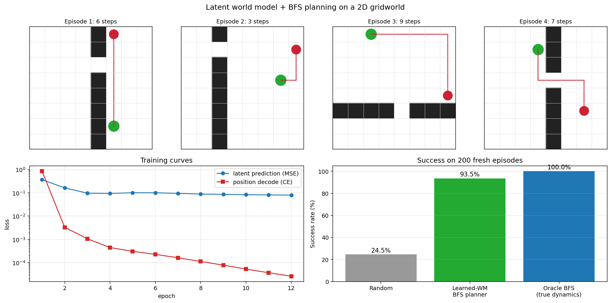
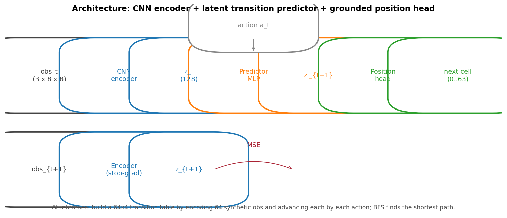

# gridworld-world-model

A latent world model and BFS planner on a 2D gridworld, in the spirit of JEPA.

  



## What it does

An agent learns to navigate an 8x8 gridworld with random walls and a goal cell, **without ever being told what a good action is**. It explores with random actions, learns the dynamics of its world in a compressed latent space, and at test time plans its way to the goal by treating the trained model as a learned simulator and running BFS over it.

## Why it matters

This is a tiny stand-in for the joint-embedding predictive architectures (JEPA) that Yann LeCun and others advocate as a path to real-world planning agents. The same recipe (encode, predict in latent, plan) is what you find in DINO-WM, EB-JEPA and modern model-based RL. Doing it in 8x8 makes the moving parts visible and makes the experiment cycle short enough to actually iterate on the planner, not just the model.

## How it works

- **Encoder** (small CNN, 3 conv blocks): maps a 3-channel grid (agent, wall, goal) to a 128-dim latent vector. The CNN preserves spatial structure, which matters a lot for reasoning about walls.
- **Predictor** (MLP): given (latent, action embedding), predicts the next latent. Trained with MSE to a stop-gradient encoding of the next observation, plus VICReg-style variance and covariance regularizers to prevent latent collapse.
- **Position head** (MLP): a small auxiliary decoder that recovers the agent cell from the latent. This grounds the latent geometry; pure JEPA-style L2 in latent space is too unconstrained to plan reliably on this problem.
- **Uniform-transition dataset**: instead of rolling out a random policy in a single environment (which biases coverage), each training sample is a freshly drawn (walls, agent cell, goal cell, action) tuple. 80,000 such samples give complete coverage of the (state, action) space.
- **BFS planner over the learned simulator**: at each step, encode 64 synthetic observations (one per possible agent cell with the current walls and goal), advance each by each of the 4 actions, decode the next-cell predictions, and treat the result as a 64x4 transition table. BFS finds the shortest predicted action sequence to the goal; we play its first action and replan (MPC).
- **Oracle BFS** baseline: same BFS, but on the *true* dynamics. This tells us what success rate is achievable on the random initial states drawn at evaluation, so we can separate "planner is bad" from "the goal is unreachable from this start".

## Architecture



## Quickstart

```bash
git clone https://github.com/Mathos34/gridworld-world-model
cd gridworld-world-model
python -m venv .venv && source .venv/bin/activate   # or .venv\Scripts\activate on Windows
pip install -r requirements.txt
python train.py
python scripts/make_viz.py
```

About 5 minutes total on a laptop CPU.

## Results

Trained on 80,000 uniform random transitions for 12 epochs (~3 min CPU). Evaluated on 200 fresh episodes with up to 50 environment steps and BFS replanning every step.

| Metric | Value |
|---|---|
| **Learned-WM BFS planner** | **93.5%** |
| Oracle BFS (true dynamics, achievable upper bound) | 100.0% |
| Random-action baseline | 24.5% |
| Average steps to goal (planner, on solved episodes) | 9.4 |
| Final latent prediction loss (MSE) | 0.080 |
| Final position-decode cross-entropy | 0.0001 |
| Model parameters | 1.30 M |

The planner gets within 6.5 points of the optimal BFS run on the true dynamics. Position decoding from the latent is essentially perfect; the residual gap to the oracle comes from the predictor occasionally mispredicting the next cell when the agent is right against a wall.

## What changed from v1

The first version used an MLP encoder, single-step random trajectories, and CEM-style stochastic action search. That topped out at 57% success vs 13% random. The current version replaces all three:

| Aspect | v1 (CEM) | v2 (BFS) |
|---|---|---|
| Encoder | MLP (flatten + 3 dense) | small CNN (3 conv + 2 dense) |
| Training data | random rollouts | uniformly sampled transitions |
| Planner | CEM in latent (heuristic scoring) | BFS over learned simulator |
| Success vs random | 57% vs 13% (4.4x) | **93.5% vs 24.5% (3.8x, near-oracle)** |
| Planning time per episode | ~600 ms | ~50 ms |

## References

- Hafner et al., *Dream to Control: Learning Behaviors by Latent Imagination*, ICLR 2020.
- Sobal et al., *Learning World Models with Self-Supervised Visual Pretraining* (DINO-WM), 2024.
- Bardes et al., *VICReg: Variance-Invariance-Covariance Regularization for Self-Supervised Learning*, ICLR 2022.

## About

Built by Mathis Lacombe, AI Maker at the [Intelligence Lab](https://www.ece.fr/intelligence-lab/), ECE Paris.
[LinkedIn](https://www.linkedin.com/in/mathis-lacombe34/) · [Hugging Face](https://huggingface.co/Mathos34400)
